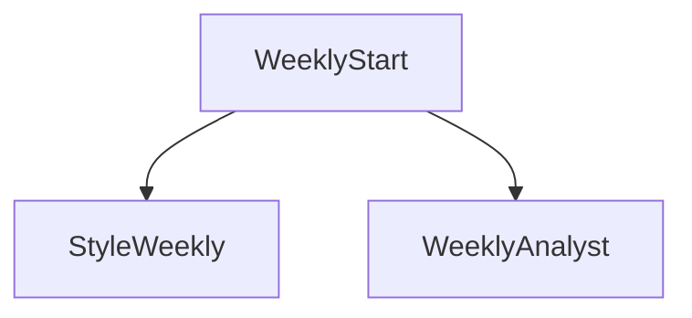

# Daily X Agent v2 - Multi-Agent Architecture Design

## 1. System Overview
Daily X Agent v2 upgrades v1 into a content-ops assistant: richer materials (plugin sources), personal style learning, optional threads (2–5 tweets), weekly retrospectives, stronger fact-grounding, better safety/observability, and easier deployment.

Key principles:
- Agents are isolated modules with strict structured I/O contracts.
- Agents do not call each other; only the Orchestrator schedules them.
- Every run is fully auditable: per-agent logs, inputs/outputs summaries, and errors (without leaking secrets).
- Human-in-the-loop remains mandatory before any posting.

## 2. Architecture

### 2.1 Core Components
- **Orchestrator**: The central brain. Maintains `RunState`, executes the state machine, handles retries/rewrites, and manages database transactions.
- **Agents**: Independent modules with strict Input/Output contracts.
- **Database (SQLite)**: Persists state, drafts, and audit logs.
- **Web Interface (FastAPI)**: Provides human interaction endpoints (Approve/Edit/Skip).
- **Scheduler (APScheduler)**: Triggers the daily workflow.

### 2.2 Agent Roster (v2)
| Agent | Role | Input | Output |
| :--- | :--- | :--- | :--- |
| **CollectorAgent v2** | Collect materials (plugin sources) | `RunState` | `Materials` (with evidence meta) |
| **CuratorAgent** | Plan angle/topic | `Materials`, `RecentPosts` | `TopicPlan` (angle + evidence mapping) |
| **StyleAgent (new)** | Learn personal style weekly | `RecentPosts`, `DevlogSnippet` | `StyleProfile` (JSON) |
| **ThreadPlannerAgent (new)** | Decide single vs thread | `TopicPlan`, `Materials`, `StyleProfile` | `ThreadPlan` |
| **WriterAgent v2** | Generate candidates (single or thread) | `TopicPlan`, `ThreadPlan`, `StyleProfile` | `DraftCandidates` |
| **CriticAgent v2** | Edit + select best | `DraftCandidates`, `Materials`, `StyleProfile` | `EditedDraft` (single or thread) |
| **PolicyAgent v2** | Grounding + safety gate | `EditedDraft`, `Materials`, `RecentPosts`, `BlockedTerms` | `PolicyReport` (claims/evidence/unsupported) |
| **NotifierAgent** | Notify human | `ApprovedDraftRecord` | `NotificationResult` |
| **PublisherAgent v2** | Publish single/thread idempotently | `PublishRequest` | `PublishResult` |
| **WeeklyAnalystAgent (new)** | Weekly recap | `WeekWindow`, `Posts` | `WeeklyReport` |

### 2.3 State Machine (Orchestrator Flow v2)
```mermaid
graph TD
    Start --> Collector
    Collector --> Curator
    Curator --> Style
    Style --> ThreadPlanner
    ThreadPlanner --> Writer
    Writer --> Critic
    Critic --> Policy
    Policy -->|PASS| Notifier
    Policy -->|REWRITE (Max 1)| Writer
    Policy -->|HOLD| Notifier
    Notifier --> WaitHuman

    WaitHuman -->|Approve| RePolicy
    RePolicy -->|PASS| Publisher
    RePolicy -->|FAIL| Blocked
    Publisher --> End
```

Weekly cron:


## 3. Data Models

### 3.1 Database Schema (v2 additions)
**Table: `runs`**
- `run_id` (UUID, PK)
- `created_at` (Timestamp)
- `finished_at` (Timestamp, nullable)
- `duration_ms` (Integer, nullable)
- `status` (running, completed, failed)
- `agent_logs_json` (List of agent execution logs)
- `last_error` (Text)

**Table: `drafts`**
- `token` (UUID, PK)
- `run_id` (FK -> runs.run_id)
- `created_at` (Timestamp)
- `expires_at` (Timestamp)
- `status` (pending, needs_human_attention, posted, skipped, error, dry_run_posted)
- `token_consumed` (Integer 0/1)
- `consumed_at` (Timestamp, nullable)
- `thread_enabled` (Integer 0/1)
- `thread_plan_json` (nullable)
- `tweets_json` (nullable)  (final tweets list if thread)
- `published_tweet_ids_json` (nullable)
- `materials_json`
- `topic_plan_json`
- `style_profile_json`
- `candidates_json`
- `edited_draft_json`
- `policy_report_json`
- `final_text`
- `tweet_id`
- `last_error`

**Table: `posts`** (For deduplication)
- `id` (PK)
- `tweet_id` (Text)
- `content` (Text)
- `posted_at` (Timestamp)

**Table: `style_profiles`**
- `id` (PK)
- `created_at` (Timestamp)
- `profile_json` (Text)

**Table: `weekly_reports`**
- `id` (PK)
- `week_start` (Timestamp)
- `week_end` (Timestamp)
- `report_json` (Text)
- `created_at` (Timestamp)

**Table: `thread_posts`** (Optional but used for idempotency)
- `id` (PK)
- `draft_token` (Text)
- `position` (Integer)
- `tweet_id` (Text)
- `content` (Text)
- `posted_at` (Timestamp)

### 3.2 Agent Contracts (Pydantic)
*See `app/models.py` for implementation details.*

## 4. Web Routes
- `GET /health`: System check.
- `GET /metrics`: Operational metrics (if enabled).
- `GET /approve/{token}`: Trigger Orchestrator to validate and publish.
- `GET /edit/{token}`: Show edit form.
- `POST /edit/{token}`: Save edit and re-run Policy check.
- `POST /regenerate/{token}`: Regenerate candidates and re-run checks.
- `GET /skip/{token}`: Mark draft as skipped.
- `POST /generate-now`: Manually trigger a run.
- `GET /drafts`: List drafts (14 days) with status filter.
- `GET /draft/{token}`: Draft detail: materials/candidates/edited/policy/evidence/logs.

## 5. Failure Handling
- **Agent Failures**: Caught by Orchestrator, logged to `runs.last_error`, workflow halts or degrades gracefully.
- **External API Failures**: (SendGrid, Twilio, X, LLM, Notion, GitHub, RSS) captured with bounded retry (max 2) and degrade.
- **Policy Failures**:
    - Recoverable (rewrite-able): Trigger REWRITE loop (max 1).
    - Unsafe/ungrounded: HOLD and require human intervention.

## 6. Migrations
v2 introduces a migration runner that applies idempotent schema upgrades on startup.
Migrations must be repeatable and safe to run multiple times.

## 7. Observability
- `/metrics` exposes run counters and average latency.
- Per-agent logs are stored under `runs.agent_logs_json` and referenced by draft detail pages.
